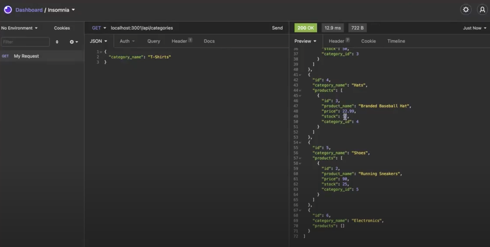

# E-Commerce-Back-End
This ecommerce back-end app is a mysql database and application backend for an e-commerce site. Built using MySQL2, Express, Sequelize and dotenv.

---

## **Table of Contents**

1. [Links](#Links)
2. [Technologies Used](#Technologies-Used)

---

## **Links**

[GitHub repository](https://github.com/dkim525/E-Commerce-Back-End)

---
## **Technologies Used**
* MySQL2
* Sequelize
* Express.js
* Insomnia
